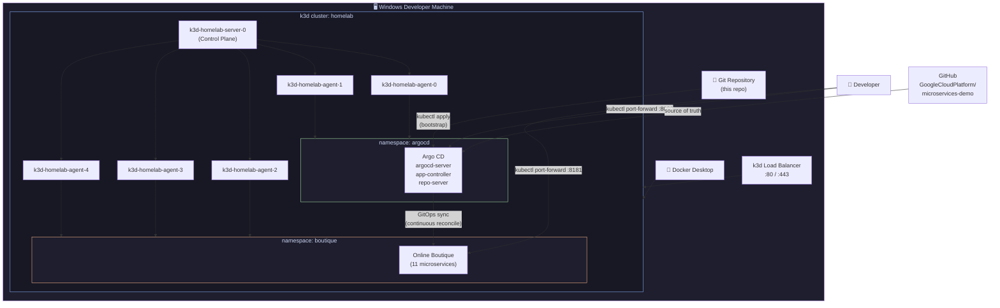

# Platform Homelab – k3d + Argo CD + Online Boutique

This repository contains a reproducible Kubernetes homelab that runs Google's Online Boutique microservices application on a local k3d cluster, managed end‑to‑end with Argo CD (GitOps).

The goal is to simulate a real production‑style platform engineering environment on a single developer machine.

---

## 1. Architecture Overview

### 1.1 High‑level design

- **Kubernetes distribution**: k3s, running inside Docker via k3d
- **Cluster topology**:
  - 1 × control plane node
  - 5 × worker nodes
- **Cluster provisioning**: declarative k3d config file (`k3d/homelab.yaml`)
- **GitOps engine**: Argo CD, deployed into `argocd` namespace
- **Demo workload**: GoogleCloudPlatform/microservices-demo ("Online Boutique"), deployed into `boutique` namespace
- **Access**:
  - `kubectl` talks to the local k3d cluster
  - Argo CD UI exposed via `kubectl port-forward`

This homelab is designed to be destroyed and recreated frequently, so all cluster‑level configuration is described as code and stored in this repository.

### 1.2 Architecture Diagram



---

## 2. Repository Structure

```text
platform-homelab/
├── k3d/
│   └── homelab.yaml              # k3d cluster definition (1 server + 5 agents)
├── argocd/
│   └── apps/
│       └── online-boutique.yaml  # Argo CD Application for Online Boutique
├── scripts/
│   └── bootstrap.ps1             # One‑command bootstrap script for Windows
└── docs/
    ├── 01-architecture.md        # Detailed architecture notes
    └── 02-gitops-flow.md         # How GitOps works in this homelab
```

You can extend this layout later with `monitoring/`, `services-overrides/`, and `docs/incidents/` as more features are added.

---

## 3. k3d Cluster Definition

`k3d/homelab.yaml` defines the entire cluster in a single file:

```yaml
apiVersion: k3d.io/v1alpha5
kind: Simple
metadata:
  name: homelab
servers: 1
agents: 5
ports:
  - port: 80:80@loadbalancer
  - port: 443:443@loadbalancer
```

This creates:

- 1 server node: `k3d-homelab-server-0`
- 5 agent nodes: `k3d-homelab-agent-0` … `k3d-homelab-agent-4`
- A load balancer that forwards host port 80/443 into the cluster

---

## 4. Argo CD Application Definition

The Argo CD Application for Online Boutique is exported from the cluster and stored under `argocd/apps/online-boutique.yaml`, so it can be reapplied to any new cluster.

Key characteristics:

- **Source repo**: `https://github.com/GoogleCloudPlatform/microservices-demo`
- **Path**: `kubernetes-manifests`
- **Destination**:
  - Cluster: in‑cluster
  - Namespace: `boutique`
- **Sync policy**:
  - Auto‑sync enabled
  - Self‑heal enabled
  - Prune enabled
  - (Optionally) auto‑create namespace

This means Argo CD continuously reconciles the live state of the `boutique` namespace with the desired state in Git.

---

## 5. One‑Command Bootstrap (Windows, PowerShell)

`scripts/bootstrap.ps1` is a thin wrapper that automates the initial setup.

Example flow:

1. **Create k3d cluster**
   ```powershell
   k3d cluster create --config k3d/homelab.yaml
   ```

2. **Install Argo CD**
   ```powershell
   kubectl create namespace argocd
   kubectl apply -n argocd `
     -f https://raw.githubusercontent.com/argoproj/argo-cd/stable/manifests/install.yaml
   ```

3. **Wait for Argo CD to become Ready**
   ```powershell
   kubectl wait --for=condition=Available deploy/argocd-server `
     -n argocd --timeout=300s
   ```

4. **Apply Argo CD Application manifest**
   ```powershell
   kubectl apply -f argocd/apps/online-boutique.yaml
   ```

5. **Port‑forward Argo CD UI (optional helper)**
   ```powershell
   kubectl port-forward svc/argocd-server -n argocd 8080:443
   ```

The script can combine all steps above so that a new contributor can run:

```powershell
.\scripts\bootstrap.ps1
```

and get a fully functional GitOps‑managed demo environment.

---

## 6. Usage Cheat Sheet

After running the bootstrap script:

| Action | Command |
|---|---|
| Check cluster nodes | `kubectl get nodes` |
| Check Argo CD pods | `kubectl get pods -n argocd` |
| Check Online Boutique pods | `kubectl get pods -n boutique` |
| Access Argo CD UI | `kubectl port-forward svc/argocd-server -n argocd 8080:443` → `https://localhost:8080` |
| Access Online Boutique UI | `kubectl port-forward svc/frontend -n boutique 8181:80` → `http://localhost:8181` |
| Destroy cluster | `k3d cluster delete homelab` |
| Recreate cluster | `.\scripts\bootstrap.ps1` |

---

## 7. Next Steps (Roadmap)

This repository currently focuses on:

- Reproducible local Kubernetes cluster (k3d)
- GitOps deployment of a real microservices app (Online Boutique) via Argo CD

Planned extensions:

| Phase | Feature |
|---|---|
| Phase 2 | Multi‑tenant isolation (namespaces, RBAC, NetworkPolicies) |
| Phase 3 | High‑availability experiments (DB failover, chaos testing) |
| Phase 4 | Advanced deployment strategies (blue/green, canary) |
| Phase 5 | Prometheus/Grafana monitoring and custom exporters |
| Phase 6 | Open source contributions based on homelab experiments |
