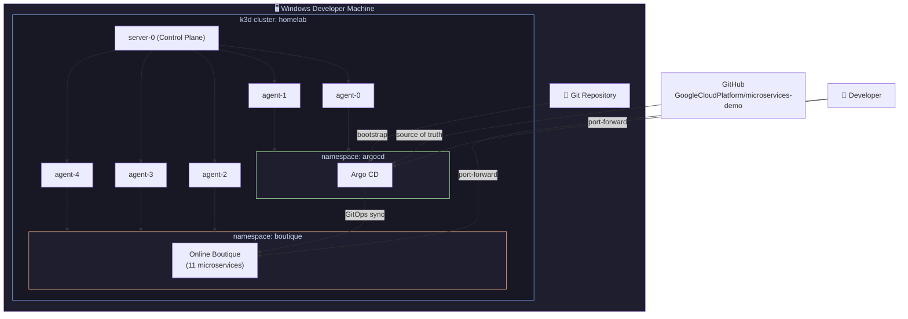
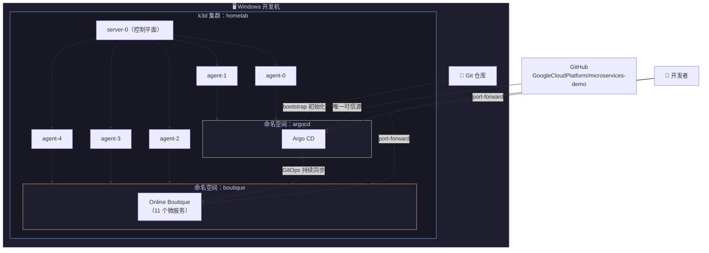

<div align="center">

# 🚀 Platform Homelab — k3d + Argo CD + Online Boutique

**Language / 语言**

[](./README.en.md)
[](./README.zh.md)

</div>

---

<!-- ████████████████████████████  ENGLISH  ████████████████████████████ -->

<details open>
<summary><strong>🇬🇧 English</strong></summary>

## Platform Homelab – k3d + Argo CD + Online Boutique

This repository contains a reproducible Kubernetes homelab that runs Google's Online Boutique microservices application on a local k3d cluster, managed end‑to‑end with Argo CD (GitOps).

The goal is to simulate a real production‑style platform engineering environment on a single developer machine.

---

### 1. Architecture Overview

- **Kubernetes distribution**: k3s, running inside Docker via k3d
- **Cluster topology**: 1 × control plane node + 5 × worker nodes
- **Cluster provisioning**: declarative k3d config file (`k3d/homelab.yaml`)
- **GitOps engine**: Argo CD, deployed into `argocd` namespace
- **Demo workload**: Online Boutique (11 microservices), deployed into `boutique` namespace



---

### 2. Repository Structure

```text
platform-homelab/
├── k3d/
│   └── homelab.yaml              # k3d cluster definition (1 server + 5 agents)
├── argocd/
│   └── apps/
│       └── online-boutique.yaml  # Argo CD Application for Online Boutique
├── scripts/
│   └── bootstrap.ps1             # One‑command bootstrap script (Windows)
└── docs/
    ├── 01-architecture.md        # Detailed architecture notes
    └── 02-gitops-flow.md         # GitOps workflow explained
```

---

### 3. One‑Command Bootstrap

```powershell
.\scripts\bootstrap.ps1
```

This script will:
1. Create the k3d cluster from `k3d/homelab.yaml`
2. Install Argo CD into the `argocd` namespace
3. Wait for Argo CD to become healthy
4. Apply the Online Boutique Application manifest
5. Print access instructions

---

### 4. Usage Cheat Sheet

| Action | Command |
|---|---|
| Check nodes | `kubectl get nodes` |
| Check Argo CD | `kubectl get pods -n argocd` |
| Check Online Boutique | `kubectl get pods -n boutique` |
| Argo CD UI | `kubectl port-forward svc/argocd-server -n argocd 8080:443` → `https://localhost:8080` |
| Online Boutique UI | `kubectl port-forward svc/frontend -n boutique 8181:80` → `http://localhost:8181` |
| Destroy cluster | `k3d cluster delete homelab` |
| Rebuild | `.\scripts\bootstrap.ps1` |

---

### 5. Roadmap

| Phase | Feature |
|---|---|
| Phase 2 | Multi‑tenant isolation (RBAC, NetworkPolicies) |
| Phase 3 | High‑availability & chaos testing |
| Phase 4 | Blue/green & canary deployments |
| Phase 5 | Prometheus / Grafana observability |
| Phase 6 | Open source contributions to CNCF projects |

> 📄 Full details → [README.en.md](./README.en.md)

</details>

---

<!-- ████████████████████████████  中文  ████████████████████████████ -->

<details>
<summary><strong>🇨🇳 中文</strong></summary>

## Platform Homelab – 本地 k3d + Argo CD + Online Boutique 实验环境

这个仓库提供了一套**可重复、一键重建**的 Kubernetes 本地实验环境：  
在 Windows 上通过 k3d 创建 k3s 集群，用 Argo CD 以 GitOps 方式部署 Google 的 Online Boutique 微服务电商应用。

目标是：在一台个人电脑上，尽可能接近真实公司的 **Platform Engineering / SRE 生产环境**。

---

### 1. 架构总览

- **Kubernetes 发行版**：k3s（通过 k3d 跑在 Docker 里）
- **集群拓扑**：1 个 control plane 节点 + 5 个 worker 节点
- **集群创建方式**：使用 k3d 配置文件（`k3d/homelab.yaml`）声明式创建
- **GitOps 引擎**：Argo CD，部署在 `argocd` 命名空间
- **演示业务**：Online Boutique（11 个微服务），部署在 `boutique` 命名空间



---

### 2. 仓库结构

```text
platform-homelab/
├── k3d/
│   └── homelab.yaml              # k3d 集群定义（1 server + 5 agents）
├── argocd/
│   └── apps/
│       └── online-boutique.yaml  # Online Boutique 的 Argo CD Application
├── scripts/
│   └── bootstrap.ps1             # Windows 下一键初始化脚本
└── docs/
    ├── 01-architecture.md        # 详细架构说明
    └── 02-gitops-flow.md         # GitOps 工作流程说明
```

---

### 3. 一键初始化

```powershell
.\scripts\bootstrap.ps1
```

脚本会自动完成：
1. 从 `k3d/homelab.yaml` 创建 k3d 集群
2. 安装 Argo CD 到 `argocd` 命名空间
3. 等待 Argo CD 就绪
4. 应用 Online Boutique Application 配置
5. 打印访问方式

---

### 4. 常用命令速查

| 操作 | 命令 |
|---|---|
| 查看节点 | `kubectl get nodes` |
| 查看 Argo CD | `kubectl get pods -n argocd` |
| 查看 Online Boutique | `kubectl get pods -n boutique` |
| 访问 Argo CD UI | `kubectl port-forward svc/argocd-server -n argocd 8080:443` → `https://localhost:8080` |
| 访问 Online Boutique | `kubectl port-forward svc/frontend -n boutique 8181:80` → `http://localhost:8181` |
| 销毁集群 | `k3d cluster delete homelab` |
| 重建集群 | `.\scripts\bootstrap.ps1` |

---

### 5. 后续计划

| 阶段 | 功能 |
|---|---|
| Phase 2 | 多租户隔离（RBAC、NetworkPolicy） |
| Phase 3 | 高可用与故障演练（chaos 测试） |
| Phase 4 | 高级发布策略（蓝绿、金丝雀） |
| Phase 5 | Prometheus/Grafana 可观测性 |
| Phase 6 | 向 CNCF 相关项目提交开源贡献 |

> 📄 完整说明 → [README.zh.md](./README.zh.md)

</details>
