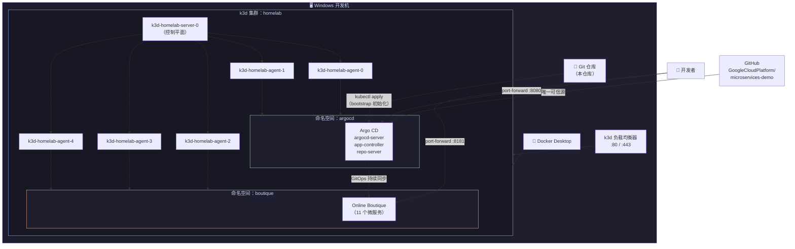

# Platform Homelab – 本地 k3d + Argo CD + Online Boutique 实验环境

这个仓库提供了一套**可重复、一键重建**的 Kubernetes 本地实验环境：  
在 Windows 上通过 k3d 创建 k3s 集群，用 Argo CD 以 GitOps 方式部署 Google 的 Online Boutique 微服务电商应用。

目标是：在一台个人电脑上，尽可能接近真实公司的 **Platform Engineering / SRE 生产环境**。

---

## 1. 架构总览

### 1.1 整体设计

- **Kubernetes 发行版**：k3s（通过 k3d 跑在 Docker 里）
- **集群拓扑**：
  - 1 个 control plane 节点
  - 5 个 worker 节点
- **集群创建方式**：使用 k3d 配置文件（`k3d/homelab.yaml`）声明式创建
- **GitOps 引擎**：Argo CD，部署在 `argocd` 命名空间
- **演示业务**：GoogleCloudPlatform/microservices-demo（Online Boutique），部署在 `boutique` 命名空间
- **访问方式**：
  - `kubectl` 直接连接本地 k3d 集群
  - 使用 `kubectl port-forward` 暴露 Argo CD UI 和业务服务

这个实验环境设计为**可随时销毁 / 重建**，所有关键配置都以代码形式保存在仓库中。

### 1.2 架构图



---

## 2. 仓库结构

```text
platform-homelab/
├── k3d/
│   └── homelab.yaml              # k3d 集群定义（1 server + 5 agents）
├── argocd/
│   └── apps/
│       └── online-boutique.yaml  # Online Boutique 的 Argo CD Application
├── scripts/
│   └── bootstrap.ps1             # Windows 下一键初始化脚本
└── docs/
    ├── 01-architecture.md        # 详细架构说明
    └── 02-gitops-flow.md         # 在本环境中 GitOps 的工作流程
```

后续可以在此基础上扩展 `monitoring/`、`services-overrides/`、`docs/incidents/` 等目录。

---

## 3. k3d 集群定义

`k3d/homelab.yaml` 声明了整个集群的形态：

```yaml
apiVersion: k3d.io/v1alpha5
kind: Simple
metadata:
  name: homelab
servers: 1
agents: 5
ports:
  - port: 80:80@loadbalancer
  - port: 443:443@loadbalancer
```

创建后会得到：

- 1 个 server 节点：`k3d-homelab-server-0`
- 5 个 agent 节点：`k3d-homelab-agent-0` … `k3d-homelab-agent-4`
- 一个负载均衡器，将宿主机的 80/443 端口转发进集群

---

## 4. Argo CD Application 定义

Online Boutique 的 Application 会从集群导出到 `argocd/apps/online-boutique.yaml`，这样在新集群上可以直接复用。

关键配置（示意）：

- **Source（源）**：
  - Repo：`https://github.com/GoogleCloudPlatform/microservices-demo`
  - Path：`kubernetes-manifests`
  - Revision：`HEAD`
- **Destination（目标）**：
  - Cluster：`in-cluster`
  - Namespace：`boutique`
- **Sync 策略**：
  - 自动同步（Enable Auto-Sync）
  - 自愈（Self Heal）
  - 自动清理多余资源（Prune）

这意味着 Argo CD 会持续把 `boutique` 命名空间的实际状态，收敛到 Git 中声明的期望状态。

---

## 5. 一键初始化脚本（Windows / PowerShell）

`scripts/bootstrap.ps1` 用于自动完成环境初始化，大致流程：

1. **创建 k3d 集群**
   ```powershell
   k3d cluster create --config k3d/homelab.yaml
   ```

2. **安装 Argo CD**
   ```powershell
   kubectl create namespace argocd
   kubectl apply -n argocd `
     -f https://raw.githubusercontent.com/argoproj/argo-cd/stable/manifests/install.yaml
   ```

3. **等待 Argo CD 就绪**
   ```powershell
   kubectl wait --for=condition=Available deploy/argocd-server `
     -n argocd --timeout=300s
   ```

4. **应用 Online Boutique Application 配置**
   ```powershell
   kubectl apply -f argocd/apps/online-boutique.yaml
   ```

5. **可选：转发 Argo CD UI 端口**
   ```powershell
   kubectl port-forward svc/argocd-server -n argocd 8080:443
   ```

脚本可以把上述步骤串成一个命令，例如：

```powershell
.\scripts\bootstrap.ps1
```

任何人克隆仓库后执行这条命令，就能在本地快速启动同样的实验环境。

---

## 6. 常用命令速查

完成 bootstrap 后：

| 操作 | 命令 |
|---|---|
| 查看节点状态 | `kubectl get nodes` |
| 查看 Argo CD 组件 | `kubectl get pods -n argocd` |
| 查看 Online Boutique 微服务 | `kubectl get pods -n boutique` |
| 访问 Argo CD UI | `kubectl port-forward svc/argocd-server -n argocd 8080:443` → `https://localhost:8080` |
| 访问 Online Boutique UI | `kubectl port-forward svc/frontend -n boutique 8181:80` → `http://localhost:8181` |
| 销毁集群 | `k3d cluster delete homelab` |
| 重建集群 | `.\scripts\bootstrap.ps1` |

---

## 7. 后续计划

当前阶段的重点是：

- 在本地快速搭建一套**可重现的** K8s 集群
- 用 Argo CD + GitOps 管理一个真实的微服务电商应用

后续会逐步加入：

| 阶段 | 功能 |
|---|---|
| Phase 2 | 多租户隔离（多 namespace + RBAC + NetworkPolicy） |
| Phase 3 | 高可用与故障演练（数据库 / 缓存 failover，chaos 测试） |
| Phase 4 | 高级发布策略（蓝绿发布、金丝雀发布） |
| Phase 5 | Prometheus/Grafana 可观测性与自定义 Exporter |
| Phase 6 | 基于本实验环境向 CNCF 相关项目提交开源贡献 |
